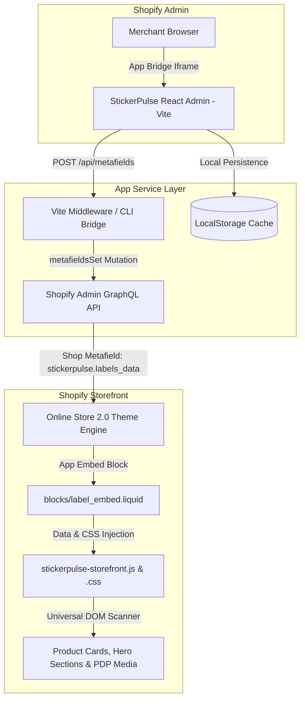

# Architecture Document
## StickerPulse — Product Labels & Badges

---

## 1. System Architecture Overview



---

## 2. Technology Stack

| Layer | Technology | Purpose |
|---|---|---|
| **Admin UI Framework** | **React 18 + Vite** | High-performance admin interface with instant HMR and lightweight bundle |
| **Shopify Integration** | **@shopify/app-bridge & @shopify/app-bridge-react** | Embedded Shopify Admin iframe communication and session detection |
| **CLI & Tunneling** | **Shopify CLI 3.x** (`shopify.app.toml`, `shopify.web.toml`) | Dev tunneling, partner dashboard linking, and extension registration |
| **Data Persistence** | **Shopify Shop Metafields** (`stickerpulse.labels_data`) | Store-level JSON metafield holding active label definitions and targeting rules |
| **Storefront Extension** | **Online Store 2.0 Theme App Extension** | Pure App Embed delivery without modifying merchant theme files |
| **Storefront Runtime** | **Vanilla ES6+ JavaScript & Scoped CSS** | Sub-15KB dependency-free execution engine with `MutationObserver` |

---

## 3. Core Subsystems

### 3.1 Embedded Admin Application (`src/`)
- **App Shell (`App.jsx`)**: Handles mount lifecycle, loads persisted labels from `shopifyService`, renders label table dashboard, and routes to editor.
- **Label Designer (`TextLabelEditor.jsx`)**: Comprehensive unified builder supporting:
  - Text and Image label modes.
  - 26 vector shape clip-paths and transforms.
  - 9-point inside anchor grid with manual pixel offsets.
  - Outside placement slot between title and price with alignment controls.
  - Real-time interactive preview simulating Collections, PDPs, Home, Search, and Cart across Desktop and Mobile views.
  - Multi-label secondary builder with independent controls.
  - Product Tag targeting input and suggestions.
- **Gallery Modal (`ImageGalleryModal.jsx`)**: Multi-source image picker supporting local uploads and SVG/PNG presets.
- **Brand Identity (`AppLogo.jsx`, `RosetteIcon.jsx`)**: Distinct visual branding.

### 3.2 Service & Synchronization Layer (`src/services/shopifyService.js`)
- **Dual-Storage Synchronization**:
  1. Writes immediately to `localStorage` for instant browser responsiveness.
  2. Dispatches `POST /api/metafields` to trigger Shopify GraphQL `metafieldsSet` mutation to update `shop.metafields.stickerpulse.labels_data`.
- **Embedded vs. Standalone Detection**: Seamlessly detects whether running inside Shopify Admin iframe or standalone development environment.

### 3.3 Storefront Theme App Extension (`extensions/product-label-embed/`)
- **App Embed Block (`blocks/label_embed.liquid`)**:
  - Activated with one click in Theme Editor > App Embeds.
  - Injects `window.StickerPulseData` with parsed shop metafields, template names, and Liquid-extracted product tags map (`productTagsMap`).
- **Storefront Engine (`assets/stickerpulse-storefront.js`)**:
  - **Universal Page Detection**: Combines template name with URL path heuristics (`/products/`, `/collections/`, `/search`, `/cart`, `/`).
  - **Tag-Based Product Matching**: Matches `targetTags` against product data-attributes, Liquid tag map, and PDP product objects.
  - **Duplicate Icon Prevention**: Sanitizes text content to eliminate double icons when emoji badges are selected.
  - **Single Featured Image Targeting**: Targets strictly the primary active media container on PDPs/hero sections and skips secondary thumbnails.
  - **Theme Customizer Event Listeners**: Listens to `shopify:section:load`, `shopify:section:select`, and `shopify:block:select` for live re-renders.
  - **Dynamic Elements Support**: `MutationObserver` monitors AJAX filters, infinite scroll, and pagination.
- **Storefront CSS (`assets/stickerpulse-storefront.css`)**:
  - High `z-index: 99 !important` ensuring badges remain visible above custom hero banners and sliders.
  - Full vector clip-paths and geometry for all 26 shapes.

---

## 4. Data Flow & Metafield Schema

### Metafield Specification
- **Owner**: `Shop` (`ownerId: "gid://shopify/Shop/<shop_id>"`)
- **Namespace**: `stickerpulse`
- **Key**: `labels_data`
- **Type**: `json`

### JSON Schema
```json
[
  {
    "id": 1,
    "name": "Eco-Friendly Label",
    "type": "text",
    "positionMode": "inside",
    "anchor": "top-left",
    "offsetX": 0,
    "offsetY": 0,
    "fillMode": "solid",
    "isActive": true,
    "targetMode": "tags",
    "targetTags": "eco-friendly",
    "textContent": "ECO-FRIENDLY",
    "fontFamily": "Inter",
    "isBold": true,
    "isItalic": false,
    "isUnderline": false,
    "selectedShape": "capsule-full",
    "bgColor": "#059669",
    "textColor": "#ffffff",
    "badgeIcon": "🌱",
    "iconPosition": "left",
    "widthPercent": 28,
    "heightPercent": 12,
    "textSizePercent": 44,
    "letterSpacing": 1,
    "imageSize": 26,
    "imageUnit": "%",
    "lockAspectRatio": true,
    "hasBorder": false,
    "borderColor": "#ffffff",
    "borderWidth": 1,
    "hasRoundCorner": true,
    "borderRadius": 999,
    "pageDisplay": {
      "productPage": true,
      "collectionPage": true,
      "homepage": true,
      "searchPage": true,
      "cartPage": true,
      "specificPages": false
    },
    "deviceDisplay": "all",
    "showMultipleLabelsPreview": false
  }
]
```

---

## 5. Security & Multi-Theme Isolation

1. **Zero Theme File Modification**: No liquid code is written to theme files; disabling the App Embed in Shopify Theme Customizer instantly restores the theme to pristine condition.
2. **Shop Scoped Permissions**: OAuth access scopes limited to `read_products`, `write_products`, `read_themes`.
3. **CORS & CSP Compliance**: All storefront assets served directly from Shopify's CDN (`asset_url`).
