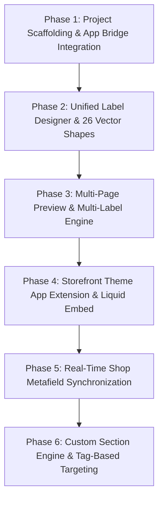

# Implementation Plan: StickerPulse (Shopify Product Label App)

---

## 1. Roadmap & Architecture Milestones

---

## 2. Section Breakdown & Completed Deliverables

### Phase 1: Project Scaffolding & Shopify Integration
* **Status**: ✅ **Completed**
* **Deliverables**:
  - React 18 + Vite application structure (`package.json`, `vite.config.js`).
  - `@shopify/app-bridge` and `@shopify/app-bridge-react` integration.
  - Shopify CLI configuration (`shopify.app.toml`, `shopify.web.toml`).
  - Brand identity system (`AppLogo.jsx`, `RosetteIcon.jsx`).

---

### Phase 2: Unified Label Designer & 26 Vector Shapes
* **Status**: ✅ **Completed**
* **Deliverables**:
  - Unified editor (`TextLabelEditor.jsx`) supporting Text & Image labels.
  - 26 vector shape clip-paths and transforms.
  - Sizing parity: Width %, Height %, Text Size %, Letter Spacing, Image Size.
  - Adjustment parity: Border width/color, rounded corners with `overflow: 'hidden'`.
  - Inside 9-point grid anchor picker + manual X/Y offsets.
  - Outside placement slot between Product Title and Price with alignment controls.

---

### Phase 3: Multi-Page Live Preview & Multi-Label Engine
* **Status**: ✅ **Completed**
* **Deliverables**:
  - Interactive top navbar preview dropdown (`collection`, `product`, `homepage`, `search`, `cart`).
  - Device preview switchers (`desktop` / `mobile`).
  - Toggleable Multi-Label Support in Display Tab with independent secondary label builder.
  - State persistence preserving all checkboxes and secondary settings across edits and reloads.

---

### Phase 4: Storefront Theme App Extension (OS 2.0)
* **Status**: ✅ **Completed**
* **Deliverables**:
  - `extensions/product-label-embed/shopify.extension.toml`.
  - `blocks/label_embed.liquid` with one-click Theme Customizer toggle.
  - `assets/stickerpulse-storefront.css` with 26 vector shape styles and `z-index: 99 !important`.
  - `assets/stickerpulse-storefront.js` injection engine.

---

### Phase 5: Real-Time Shopify Shop Metafield Sync
* **Status**: ✅ **Completed**
* **Deliverables**:
  - `src/services/shopifyService.js` handling dual-storage persistence.
  - Vite dev server API bridge (`/api/metafields`) executing Shopify GraphQL `metafieldsSet` mutation.
  - Instant synchronization to `shop.metafields.stickerpulse.labels_data`.

---

### Phase 6: Custom Section Support & Tag-Based Targeting
* **Status**: ✅ **Completed**
* **Deliverables**:
  - Deep custom section discovery for `pseo_product_hero`, custom hero sliders, and bespoke PDPs.
  - Product Tag Targeting allowing badges to filter strictly by tags (e.g. `eco-friendly`).
  - Single primary image targeting on PDPs (ignoring thumbnails and swatches).
  - Duplicate emoji sanitization preventing double icons in badges.
  - Shopify Theme Customizer event listeners (`shopify:section:load`, `shopify:section:select`).

---

## 3. Progress Tracking

| Phase | Description | Status | Verification |
|---|---|---|---|
| **Phase 1** | App Scaffolding & App Bridge Setup | ✅ Completed | `npm run build` passes; iframe loads in Shopify Admin |
| **Phase 2** | Unified Editor & 26 Vector Shapes | ✅ Completed | Live preview updates all shapes, borders, and corners |
| **Phase 3** | Multi-Page Previews & Multi-Label Suite | ✅ Completed | Parity verified across all 5 preview page layouts |
| **Phase 4** | Theme App Extension (App Embed) | ✅ Completed | Extension registers in Shopify CLI & Theme Customizer |
| **Phase 5** | Shopify Metafield Real-Time Sync | ✅ Completed | GraphQL `metafieldsSet` verified on live dev store |
| **Phase 6** | Custom Section Heuristics & Tag Targeting | ✅ Completed | Badges render exclusively on tagged products on storefront |
